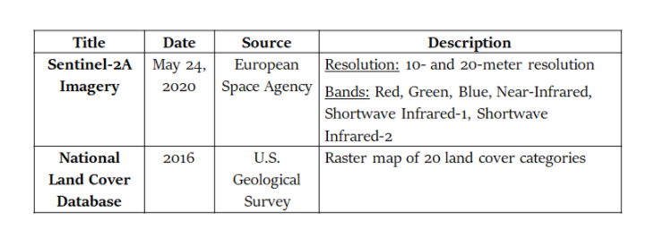
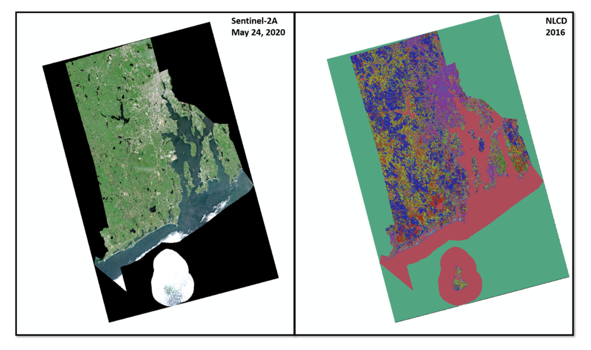
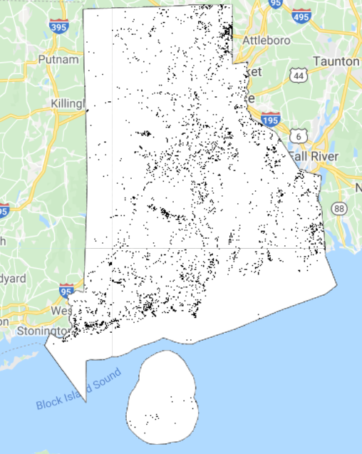
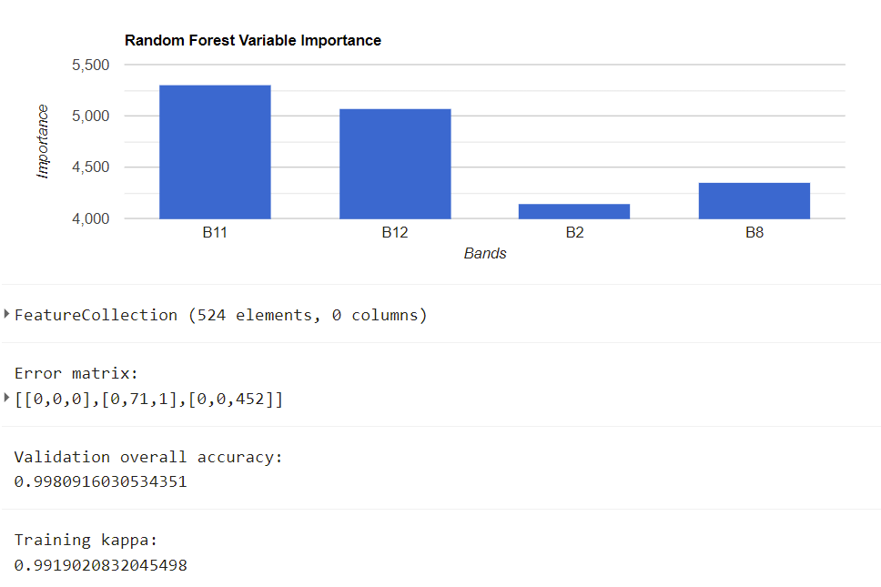

# Conducting Image Classification of Utility Scale Solar Fields in Rhode Island using Random Forest in Google Earth Engine
This tutorial provides users with a step-by-step guide to conduct pixel-based classification of utility scale solar fields using Random Forest within Google Earth Engine. More specifically, users will utilize a Random Forest algorithm to classify two classes in the Sentinel-2A imagery: Solar Fields and Non-Solar. 

The Random Forest algorithm was chosen because it is a robust machine learning algorithm used to identify target classes in satellite imagery and produces proficient results. For this example, you will utilize a Random Forest algorithm to classify two classes in the Sentinel-2A imagery: Solar Fields and Non-Solar. 

You can read more about Random Forest Applications for Image Classification [here](https://www.mdpi.com/2072-4292/8/11/954/htm) , [here](https://developers.google.com/earth-engine/apidocs/ee-classifier-smilerandomforest) , and [here](https://developers.google.com/earth-engine/guides/classification)


### Importance & Challenges/Limitations
- The purpose of this project was to design a free and open-source remote sensing methodology to identify utility-scale solar fields and monitor subsequent land cover conversion in Rhode Island. The results of this project are intended to inform stakeholders about the rate of deforestation in Rhode Island due to fast-paced solar field development. The challenges of developing a script that acquires utility scale solar fields include finding cloudless imagery, using the appropriate amount of training data, and choosing Random Forest parameters to fine tune the model.

### What you will need:
- A Google Earth Engine Account
- Google Drive Account to have a location for outputs
- The Example Script: https://code.earthengine.google.com/79af001194514c38534641632fe4b6e2
- Training Data for Algorithm to identify Solar v. Non-Solar: Data is located in the Data Folder. Merged Contains both categories.

### The script should:
1. Generate a training dataset consisting of 17 polygons of solar fields (including arrays and the dirt edges immediately surrounding the arrays) and 18 non-solar in Rhode Island. Solar has a value of 1 and non-solar has a value of 2.
2. Modify the Random Forest algorithm so that is trained for 1,000 iterations using the most valuable electromagnetic bands for detecting solar arrays: **Blue, Near-Infrared, Shortwave Infrared-1, Shortwave Infrared-2**. 
3. Split the data: 80% of the samples should be used to train the algorithm and 20% of samples were used to test the algorithm. 
4. Apply the trained model to the entire Sentinel-2A scene to produce a hard classification of solar fields and non-solar. The output from the random forest classification is a raster layer of the hard classification. 

### Data & Desired Outputs:
- [Tiger 2018 US Census State Boundaries](https://developers.google.com/earth-engine/datasets/catalog/TIGER_2018_States)
- [Sentinel 2a Mosaicked Image](https://developers.google.com/earth-engine/datasets/catalog/COPERNICUS_S2_SR)
- [National Land Cover Database Image](https://developers.google.com/earth-engine/datasets/catalog/USGS_NLCD_RELEASES_2016_REL)
- Random Forest Classification Image
- Random Forest Classification Band Importance (Variable Importance)
- Random Forest Accuracy Assessment Tables




The Data Layers should look similar to this:



### 1. Getting Started - Selecting a AOI
- The first step is to navigate to the state of Rhode Island in the Google Earth Engine Map Viewer.
- Import Tiger 2018 State Boundaries using the code snippet below
```js
// Filter to Rhode Island
var states = ee.FeatureCollection('TIGER/2018/States');
var ri = states.filter(ee.Filter.eq('NAME', 'Rhode Island'));
var region = ri.geometry();
//Map.addLayer(ri);
```

### 2. Obtain, Crop, and Display the Sentinel-2A Image from May 24, 2020
```js
// Get Sentinel 2a Image from May 24, 2020 and Filter the Bounds to Rhode Island Boundary

var image = ee.ImageCollection('COPERNICUS/S2_SR');
var S2 = image.filterDate('2020-05-23', '2020-05-25')
            .filterBounds(ri);

// Printing Image Allows User to see the specific name of the image
print(S2);

// Mosaic the Image to stitch all parts and select relevant Bands
var mosaic = S2.mosaic().clip(ri).select("B2", "B3", "B4", "B8", "B11", "B12");

// Visualization Parameters
var rgbVis = {
  min: 0.0,
  max: 3000,
  bands: [ 'B4', 'B3', 'B2'],
};

Map.addLayer(mosaic,rgbVis, 'RI');
```

### 3. Add the National Land Cover Database Image (NLCD)
```js
// Process Land Cover: Select Band and Clip to RI using clipToCol Function)
var clipToCol = function(image){
  return image.clip(ri);
};
var final_LC = LC.select('landcover').map(clipToCol)
Map.addLayer(final_LC)
```
### 4. Begin the Random Forest Script
- You may create your own training data or utilize the provided training data in the script linked above
- Start by Merging the Training Data of Solar and Non-Solar Polygons to create a new combined feature collection
- Next, select the relevant bands from the Mosaicked Sentinel-2A Image
```js
//Random Forest Script-------------------------------------------------------------------------------

//Merge Feature Collections
Map.addLayer(solar)
Map.addLayer(non_solar)

var newfc = solar.merge(non_solar);
print(newfc);

// Now select the bands from the Sentinel-2A image to be used for training
var bands = ["B2", "B8", "B11", "B12"];
```
- Next, split the training data into two sets: Training & Validation
```js
//Split sample data for training and validation
var sample = newfc.randomColumn();
var split = 0.8;  // Roughly 80% training, 20% testing.
var training = sample.filter(ee.Filter.lt('random', split));
var validationdata = sample.filter(ee.Filter.gte('random', split));
```
- Begin Training the Data with the New Feature Collection. 
- Landuse is the property that defines how each feature in the collection is categorized (i.e Solar v. Non-Solar)
- The scale is set to 10 because the Sentinel-2A image's resolution is 10m 
- Exception: SWIR Bands are 20m, so we will sample those bands at 20m. This code does not resample the pixel size
```js
// Define the bands to be used to train your data
var training = mosaic.sampleRegions({
  collection: newfc,
  properties: ['landuse'],
  scale: 10
});
```
- Classify the Image with the newly developed Random Forest Classifier that uses 1000 trees. Try using 1,000 and 10,000 trees and see how they differ
```js
// Make a Random Forest classifier and train it
var classifier = ee.Classifier.smileRandomForest(1000).train({
      features: training,
      classProperty: 'landuse',
      inputProperties: bands
    });
// Classify the input imagery.
var classified = mosaic.select(bands).classify(classifier);
```

### 5. Variable Importance (Variables are the sampled Bands of the Sentinel-2A image)
```js
// The following code will produce Variable Importance Metrics
var dict = classifier.explain();
print('Explain:',dict);

var variable_importance = ee.Feature(null, ee.Dictionary(dict).get('importance'));

var chart =
  ui.Chart.feature.byProperty(variable_importance)
    .setChartType('ColumnChart')
    .setOptions({
      title: 'Random Forest Variable Importance',
      legend: {position: 'none'},
      hAxis: {title: 'Bands'},
      vAxis: {title: 'Importance'}
    });

print(chart); 
```
### 6. Display the Random Forest Classified Image
```js
var palette =['0000FF', 'ffa500'];

//Display Classification
Map.addLayer(classified, {min: 1, max: 2}, 'RF classification');
```
- The output of the Classified Image should look like this:




### 7. Conduct the Accuracy Assessment
- Validate using the split data (20% left out for training)
- Generate A Classification Error Matrix
- Provide Classification Accuracy
```js
// Conduct the accuracy Accessment
var validation = classified.sampleRegions({
  collection: validationdata,
  properties: ['landuse'],
  scale: 30,
});
print(validation)
var testAccuracy = validation.errorMatrix('landuse', 'classification');
print('Error matrix: ', testAccuracy);
print('Validation overall accuracy: ', testAccuracy.accuracy());
print('Training kappa: ', testAccuracy.kappa());
```

- The output of the Results in the Console to the Right should look like this:



### 8. Export the Products (Sentinel-2A Image, Land Cover Image, and Classified Image)
- Additionally, there is an export for the merged feature class of Solar and Non-Solar
```js
// Export the Sentinel-2A Mosaicked image, specifying scale and region.
Export.image.toDrive({
  image: mosaic,
  description: 'RI_mosaic',
  scale: 10,
  region: ri,
  crs: 'EPSG:4326',
  fileFormat: 'GeoTIFF'
});

// Export the Land Cover image, specifying scale and region.
Export.image.toDrive({
  image: final_LC,
  description: 'RI_LC',
  scale: 30,
  region: region,
  crs: 'EPSG:4326',
  fileFormat: 'GeoTIFF'
});

// Export the Classified image, specifying scale and region.
Export.image.toDrive({
  image: classified,
  description: 'RF_RI',
  scale: 10,
  region: ri,
  crs: 'EPSG:4326',
  fileFormat: 'GeoTIFF'
});

// Export the Merged Feature Class to hold on to
 Export.table.toDrive({
   collection: newfc,
   description:'merged',
   fileFormat: 'SHP'
});
```
# Next Steps
- Users can follow the continued High-Level Methodology of this analysis by navigating to this page: [Clark University Solar Field Project](https://maxenger.github.io/solar/Storymap.html)
- For a more in depth methodology, check out the Tutorial PDF in the Repository.

# Acknowledgements
- This project was led by Maxwell Enger, Emily Evenden, and John Rogan
